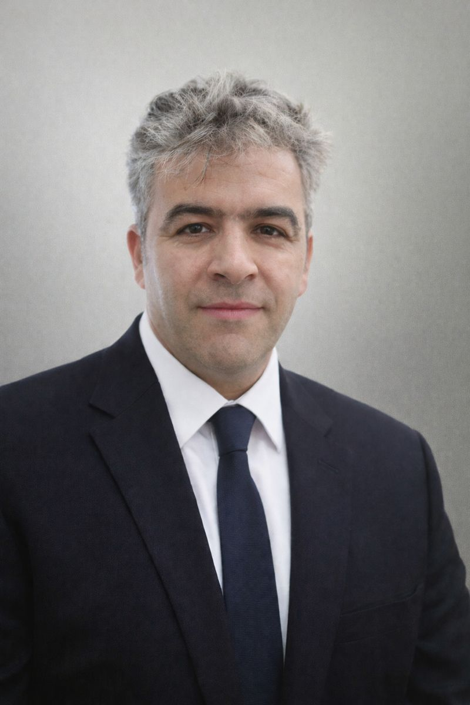

# Mohammad (Arash) Ghasemi

## Research Engineer

**Renewable Energy Systems • Battery Energy Storage Systems (BESS) • Photovoltaics • Energy System Modelling • Industrial Energy Systems**

---

📍 Sweden

📧 **Email:** <anders.arash@gmail.com>

🔗 **LinkedIn:** <https://www.linkedin.com/in/mohammad-ghasemi2020/>

🆔 **ORCID:** <https://orcid.org/0000-0001-6463-3104>

🎓 **Google Scholar:** <https://scholar.google.com/citations?user=Ta5Mmo4AAAAJ>

📄 CV: Coming Soon

---
## Navigation

🏠 [Home](README.md)

👤 [About Me](about.md)

🔬 [Research](research.md)

📚 [Publications](publications.md)

🚀 [Projects](projects.md)

📝 Research Notes *(Coming Soon)*

📄 CV *(Coming Soon)*

## Welcome

Welcome to my personal research website.

I am a research-oriented engineer with interdisciplinary expertise in renewable energy systems, battery energy storage systems (BESS), photovoltaic systems, energy modelling, and techno-economic assessment. My goal is to contribute to the sustainable energy transition through innovative research and close collaboration between academia and industry.

This website documents my research activities, publications, projects, and professional development.

---
## Research Vision

My long-term research goal is to develop intelligent, resilient, and economically sustainable energy systems through the integration of renewable energy technologies, battery energy storage systems (BESS), photovoltaic systems, heat pumps, artificial intelligence, and advanced energy system modelling.
My work aims to support industrial decarbonization and the Nordic energy transition by combining engineering principles, operational optimization, and data-driven decision support for future low-carbon energy systems.

---
## Research Interests

### Renewable Energy
- Photovoltaic Systems
- Solar Thermal Energy
- Heat Pump Technologies
- Industrial Energy Systems

### Energy Storage
- Battery Energy Storage Systems (BESS)
- State of Charge (SOC)
- State of Health (SOH)

### Energy Systems
- Energy System Modelling
- Multi-energy Systems
- Grid Integration
- Energy Flexibility

### Artificial Intelligence
- Explainable AI for Energy Systems
- Machine Learning
- Data-driven Decision Support

### Sustainability
- Techno-economic Assessment
- Industrial Decarbonization
- Sustainable Energy Transition

---

## Education

- MSc Mechanical Engineering
- MSc Solar Energy Engineering
- MSc Electric Vehicle Engineering
- MSc Business Administration (MBA)

---

## Publications

- Energy Conversion and Management (Elsevier)
- Journal of Computational & Applied Research in Mechanical Engineering
- 14th IEA Heat Pump Conference

---
## Academic Highlights

- Four Master's degrees in Engineering and Business Administration
- Three scientific publications
- Published in *Energy Conversion and Management* (Elsevier)
- Research collaboration with Absolicon Solar Collector AB
- More than 20 years of engineering and EPC project experience

---
## Current Focus

I am currently seeking research opportunities in Europe in areas including:

- Renewable Energy Systems
- Battery Energy Storage Systems
- Energy System Modelling
- AI for Energy Systems
- Industrial Decarbonization
- Sustainable Energy Transition

---
## Website Status

🚧 This website is currently under development as part of **Project Horizon 2030**.

More research projects, publications, and technical resources will be added soon.
